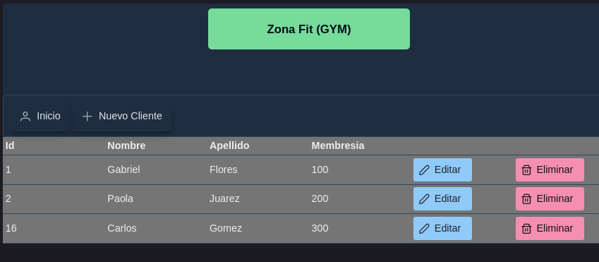

# Zona Fit GYM

Ejercicio CRUD para la gestión de clientes inscriptos en Zona Fit GYM.

El sistema sigue una arquitectura de capas basada en MVC y utiliza MySQL como base de datos para la persistencia de la información.

Para el desarrollo se empleó Spring Boot. Se utilizó Maven como gestor de dependencias, incorporando Spring Data JPA, MySQL Driver y Lombok.

La interfaz de usuario (UI) fue desarrollada con JavaServer Faces (JSF) y la biblioteca de componentes PrimeFaces, complementándose con herramientas de HTML.

Interfaz gráfica del sistema:

